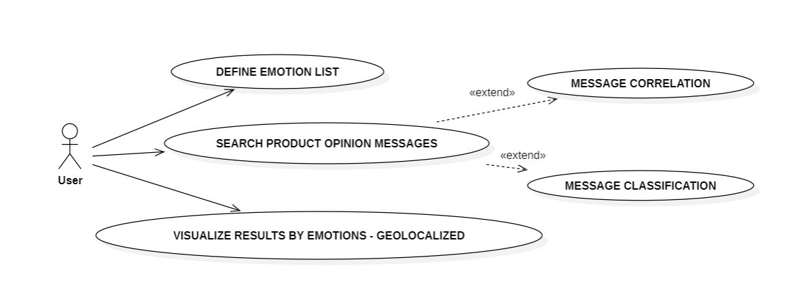
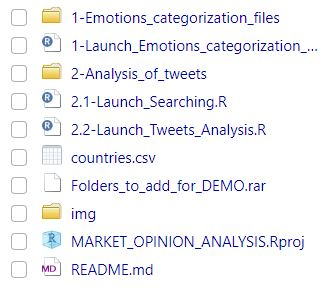

# Market Opinion Analysis Prototype

-   **Author**: Haizea Rumayor Lazkano
-   **Last update**:

------------------------------------------------------------------------

This GitHub project features a prototype designed to gauge market sentiment about a product and facilitate geolocated action planning.

## Overview

The prototype was developed in 2016 using `R`, incorporating `text mining`, `sentiment analysis` and `visualizations` to leverage these functionalities:

## Project structure

The project consists of these files and folders:

-   Two working directories:
    -   `1-Emotions_categorization_Files`
    -   `2-Analysis_of_Tweets`
-   A comma-separated file:
    -   `countries.csv`
-   A compressed file:
    -   `Folders_to_add_for_DEMO.rar`
-   Three scripts that corresponds to the three main tasks of the program:
    -   `1-Launch_Emotions_categorization_Files_Creation.R` - for tweet search.
    -   `2.1-Launch_Searching.R` : for creation of categories.
    -   `2.2-Launch_Tweets_Analysis.R` - analysis of tweets.
