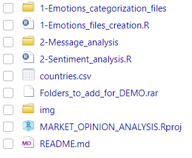

# Market Opinion Analysis Prototype

-   **Author**: Haizea Rumayor Lazkano
-   **Last update**: August 2024

------------------------------------------------------------------------

This GitHub project presents a prototype for analyzing market sentiment regarding a product and supporting geolocated action planning. Originally developed in 2016, the prototype has been updated this year to reflect current capabilities and improvements.

## Overview

The prototype was initially created in 2016 using `R`, featuring functionality for `text mining`, `sentiment analysis`, and `visualizations`. The key functionalities of the prototype include:

-   **Sentiment Analysis**: Analyzes sentiment in text data to gauge market opinions.
-   **Geolocated Action Planning**: Assists in planning actions based on geolocation data.


**Note**: The original 2016 version accessed Twitter (now X) for retrieving messages and performing sentiment analysis. Due to changes in platform access policies, this functionality is no longer available for free. As a result, the messages search feature has been omitted in the updated version.

However, historical texts collected at that time are preserved and included in the `Folders_to_add_for_DEMO.rar` archive. These texts can be used to verify and validate the sentiment analysis performed by the prototype.

## Features

The updated version of the prototype includes the following features:

-   **Sentiment Analysis**:
    -   Analyzes positive and negative sentiments from text data.
    -   Provides visualizations of sentiment results.
-   **Geolocation-Based Insights**:
    -   Offers insights into sentiment distribution based on geographical location.
-   **Customizable Emotion Categories**:
    -   Allows users to add or update emotion categories for sentiment analysis.
    -   Supports both positive and negative emotion categories.
-   **Data Handling and Visualization**:
    -   Provides tools to manage and visualize sentiment data and emotion categories.
    -   Includes functionalities for creating and displaying default sentiment files.

## Project structure

The project consists of these files and folders:



-   Two working directories:
    -   `1-Emotions_categorization_files`
    -   `2-Message_analysis`
-   A comma-separated file:
    -   `countries.csv`
-   A compressed file:
    -   `Folders_to_add_for_DEMO.rar`
-   Two scripts that corresponds to the two main tasks of the program:
    -   `1-Emotions_files_creation.R` : Handles the creation of emotion categories.
    -   `2-Sentiment_analisis.R`: Manages sentiment analysis.

## Installation

The project requires the free installation of the `R programming environment` and language.

`R` is available for all major operating systems: `Windows`, `macOS`, and `Linux`. It is open-source, widely used, and supported by an active user community.

### Steps to Install R:

1.  **Download R:**
    -   Visit the official CRAN website to download the latest version of R: [CRAN R Project](https://cran.r-project.org/).
2.  **Install R:**
    -   **For Windows:**
        -   Download the Windows binary (.exe) file from the CRAN website.
        -   Run the installer and follow the on-screen instructions.
    -   **For macOS:**
        -   Download the macOS binary (.pkg) file from the CRAN website.
        -   Open the downloaded file and follow the installation prompts.
    -   **For Linux:**
        -   Follow the specific instructions for your Linux distribution available on the CRAN website or use the package manager of your distribution to install R.
3.  **Verify Installation:**
    -   Open a terminal (or command prompt on Windows) and type `R` to start the R console.
    -   You should see the R console welcome message if the installation was successful.

## Usage

To use this prototype, ensure you have `R` installed on your system. Once you installed follow these steps:

1.  **Clone the repository**:

``` sh
git clone https://github.com/HaizeaRL/SENTIMENT_ANALYSIS 
```

2.  **Navigate to the project directory**:

``` sh
cd market-opinion-analysis
```

### Steps to create emotions files

### Steps for sentiment analysis
