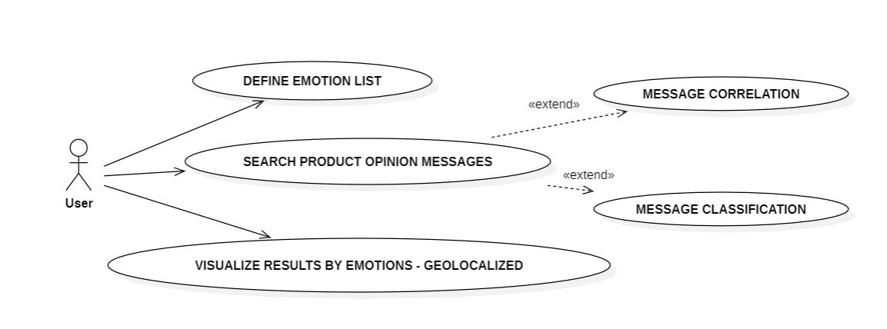

# Market Opinion Analysis Prototype

-   **Author**: Haizea Rumayor Lazkano
-   **Last update**:

------------------------------------------------------------------------

This GitHub project features a prototype designed to gauge market sentiment about a product and facilitate geolocated action planning.

## Overview

The prototype is developed using `R` using `text mining`, `sentiment analysis` and `visualizations` to leverage these functionalities:

